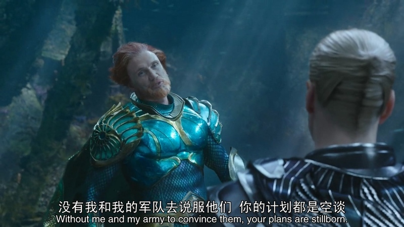
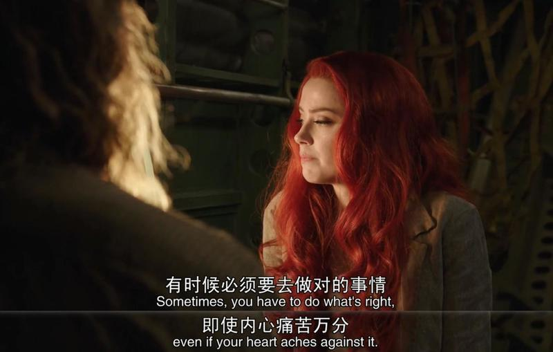
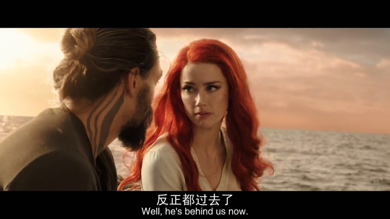

jelly n.果冻 adj.果冻状的

be/feel like jelly | turn to ˈjelly
(of legs or knees 双腿或双膝) to feel weak because you are nervous 紧张得发软

hear sb out 听某人把话说完

Please hear me out. This is important. 先听我说完 这事很重要。

convince sb. 说服某人

stillborn adj 失败的，夭折的

Not even close 

I'm not even close to done. 我都还没开始说呢。

out of sb. element - to feel unhappy or strange because you are in a situation that you are not familiar with

charter:指承租大型运输工具，如飞机、轮船、大客车以及火车等。

hire: 短期租用

charter还有宪章、特许证的意思

Private jet was chartered by Owen Kravecki this morning. 欧文卡维奇今早承租一架私人飞机。

ache /eɪk/ 痛

ache against sth 对什么感到疼痛

itch / ɪtʃ/ 痒

marina 船坞，小艇停靠区

