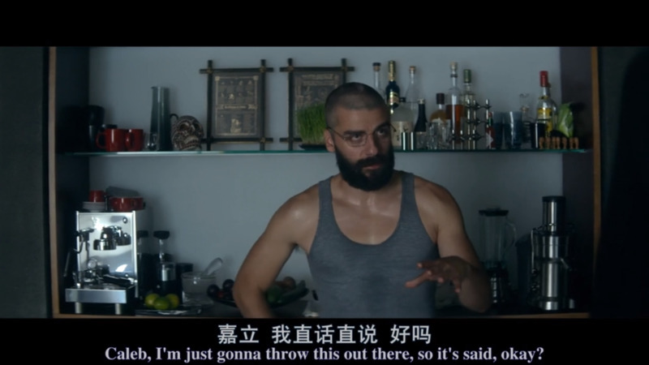
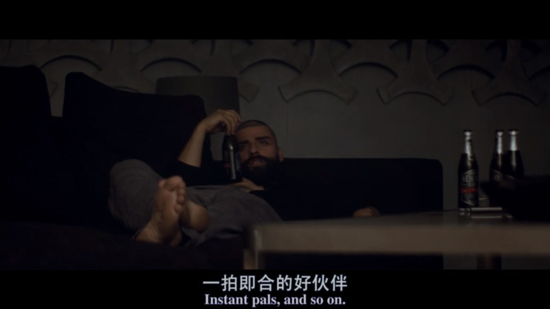

How long until we get to somewhere?

还有多久到？

throw this out there

有话直说，说出来

freak out 吓到

Actually, I was totally freaking out 实际上是，我已经完全吓坏了

quotable /ˈkwoʊtəbl/

值得引用的（这里的字幕组翻译应该翻译错了）

instant pals

一拍即合的伙伴

refill 重新装满，续杯

Want a refill? -I'm all right, thanks. 还要再加一点吗？ 不用了，谢谢。

Time flies 时光飞逝

crack sb. up

1. 垮掉，崩溃
You'll crack up if you carry on working like this. 你再这样干下去，身体会垮掉的。
2. 大笑
He walked in and everyone just cracked up. 他一进来，人人都捧腹大笑起来。

get (sb) off the ˈhook | let sb off the ˈhook

to free yourself or sb else from a difficult situation or a punishment （使）摆脱困境，逃避惩罚

So, you guys are both just gonna let me off the hook? 所以你们打算就这么轻易放过我吗？

I need to go to the toilet. Could you let me off the hook? 我要去卫生间。你能帮我脱身吗？

She will not be let off the hook. 她不可能逃脱惩罚的。