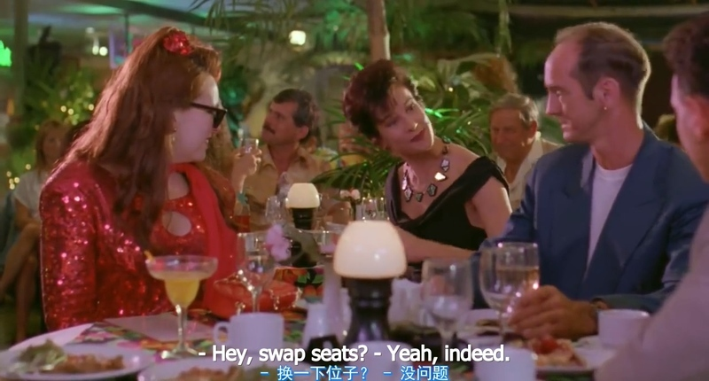
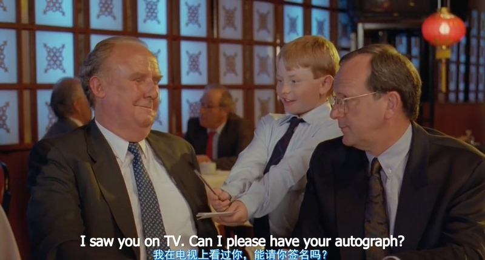

dole 失业救济金

be on the dole 固定搭配

claim dole 申领救济金

apprentice 学徒

apprentice editor 见习编辑

locksmith 锁匠

have an affair外遇

chuck 丢弃，抛弃，放弃

swap seats换一下位置

swap交换

I've finished this magazine. Can I **swap with you**?

这本杂志我看完了，能跟你交换一下吗？

Can we **swap places**? I can't see the screen.

咱俩交换一下座位好不好？我看不见银幕。

I'll drive there and then we'll **swap over** on the way back.

去的时候我开车，回来的时候咱俩再倒换过来。

Let's **do a swap**. You work Friday night and I'll do Saturday.
咱俩调个班吧。你星期五晚间上，我星期六上。

jilt 专指遗弃(情人)

He was jilted by his fiancée.
他被未婚妻抛弃了。

autograph 专指（名人的）亲笔签名

也可以用作verb

The whole team has autographed a football, which will be used as a prize.
全体队员在一个足球上签了名，用作奖品。

get sick and tired of doing sth.

厌倦了做某事

have been through 经受

you have been through a lot. 你经历了这么多

but over the past two years, I have been through a lot.
但是近两年我经历了很多事。

I don't think a lot of people have been through what you just did.
很少人能有你的经历。

With you in a sec. 马上过去