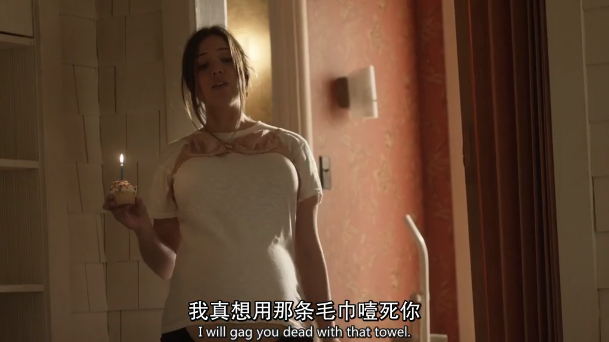

gag v.塞住，窒息 n.口塞

The hostages were bound and gagged.
人质被绑起来并被人用东西塞住了嘴。

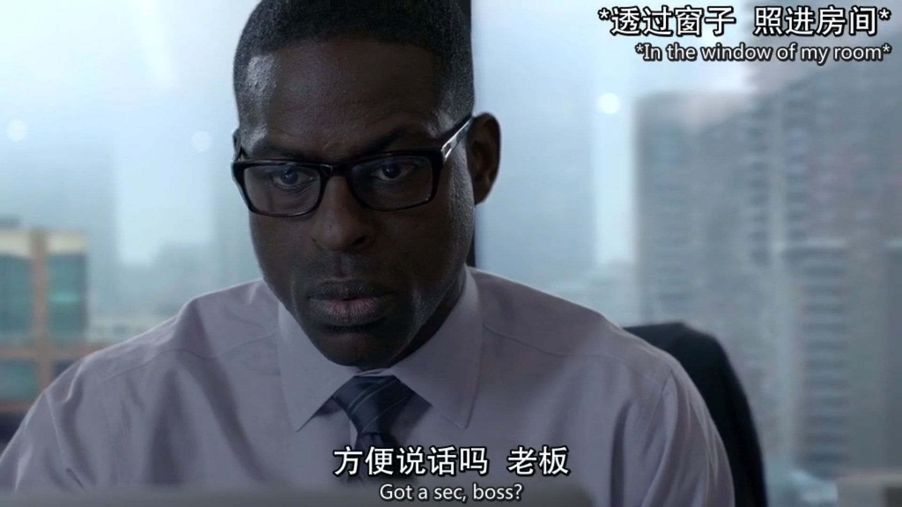

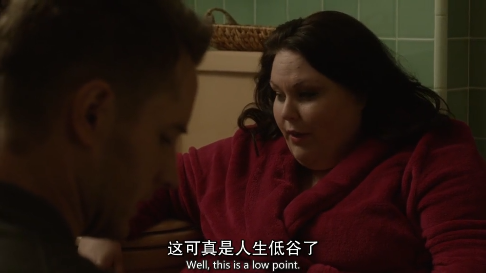

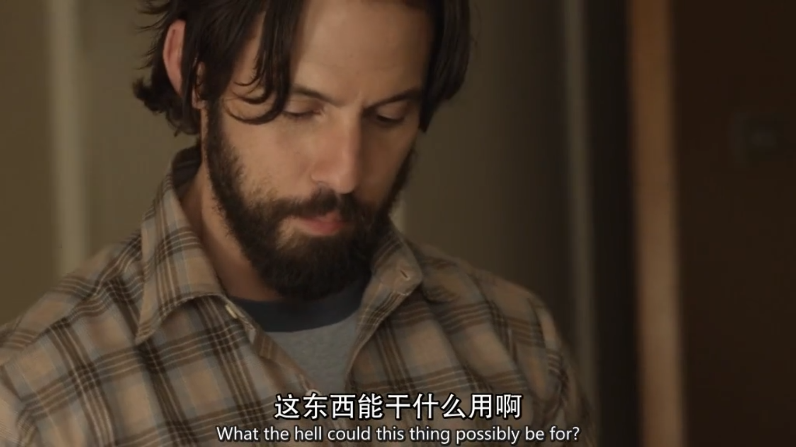

What's this for?

What could this be for?

The horns must be for personal use only.
犀牛角仅限个人使用。

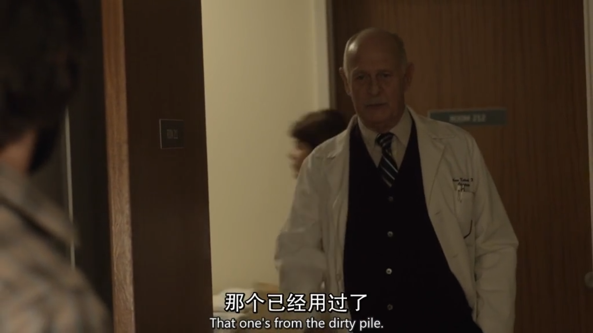

dirty pile

pile /paɪl/: 一堆

I thought I put it in that pile of dirty clothes.
我想是不是被我放在脏衣服篮里了

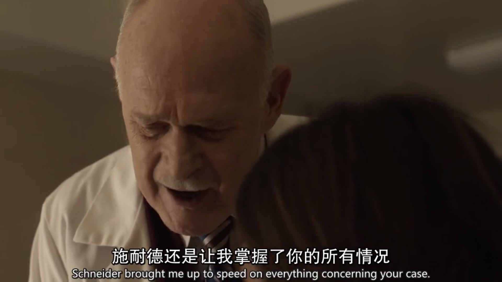

bring sb. up to speed on sth.

让某人快速了解、熟悉某事

I've just been brought up to speed with what's going on here.
我刚刚才被人告知你们的案子。

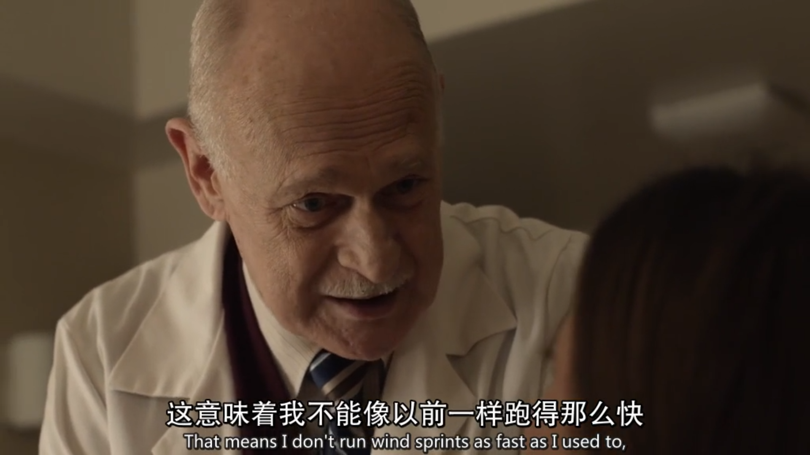

wind sprints 极速短跑

run wind sprints

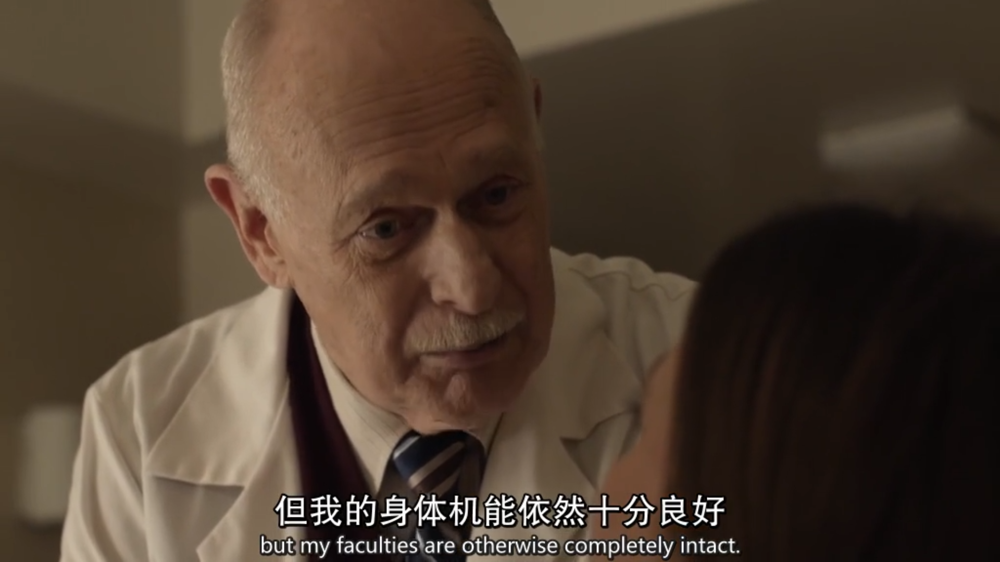

faculty 

1.官能，能力

2.（高等院校的）系，院

3.（高等院校中院、系的）全体教师

the faculty of sight
视觉

He has the faculty of doing two things at the same time.
他有同时做两件事的能力。

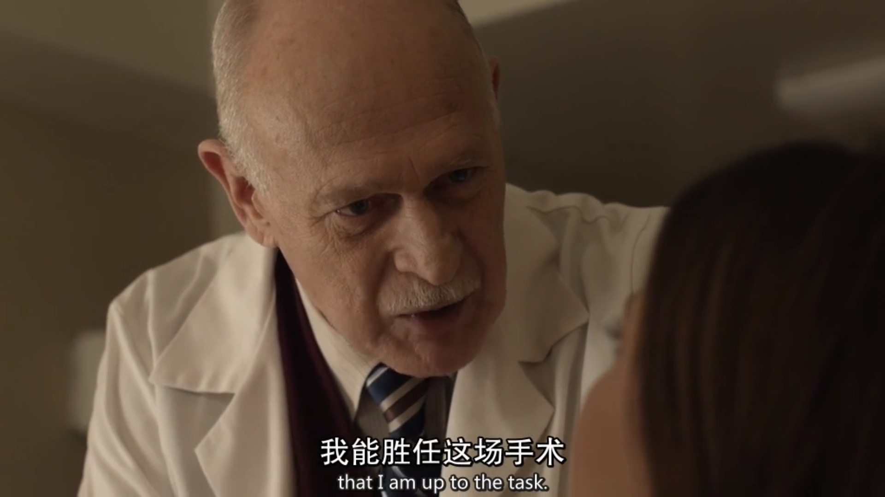

be up to 胜任

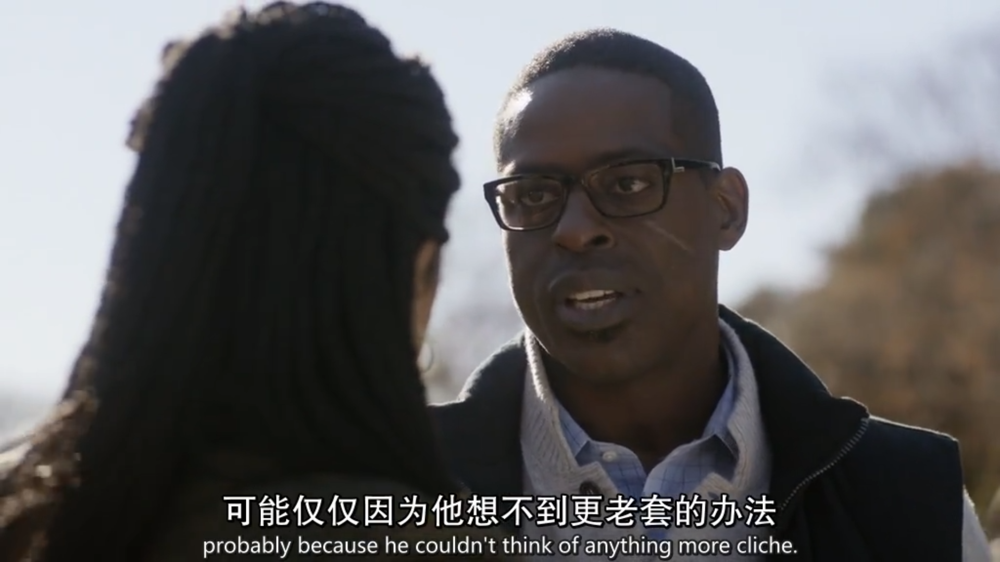

cliche /kliːˈʃeɪ/ n. adj. 陈词滥调；陈腐的

Do I dare live out the cliche?
我敢打破传统吗？

So you're saying I'm some kind of Cliche?
所以你觉得我很老套吗？

It sounds cliche, but this is a biggie. 
听起来是陈词滥调，但是这是一个大问题。

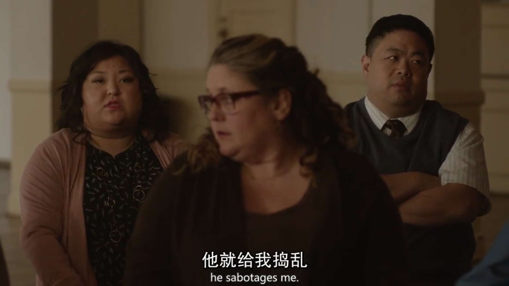

sabotage /ˈsæbətɑːʒ/ 妨碍，破坏

How dare you sabotage my case?
你怎么敢干涉我的案子？

But then you sabotaged me with Dan.
但是你却在Dan面前诋毁我。

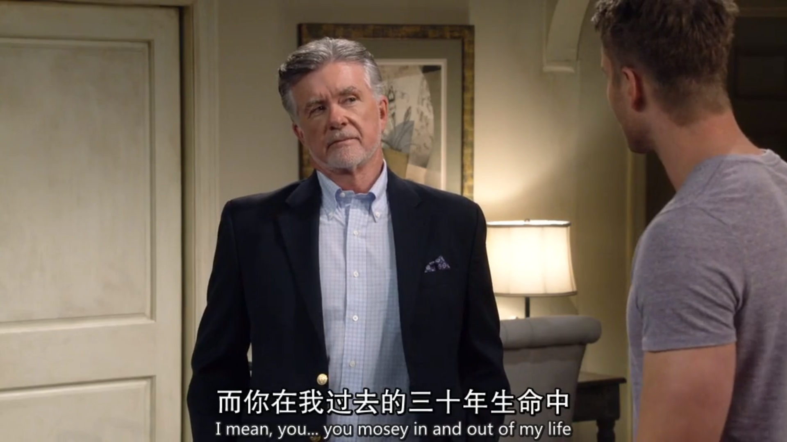

mosey /ˈmoʊzi/<非正>漫步;溜达

I'll just have a mosey round.
我只要四处逛一逛。

In fact, some mornings I'll just mosey down to the third floor in my pajamas
实际上 在某些早晨 我会穿着睡衣跑去三楼

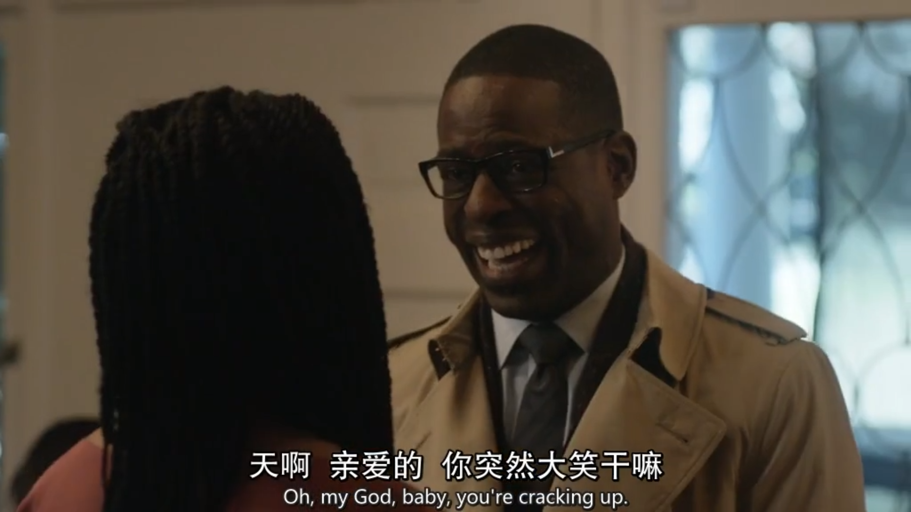

crack up 开始大笑起来; （因压力造成身体或精神）垮掉，崩溃

He walked in and everyone just cracked up. 他一进来，人人都捧腹大笑起来。

That movie cracked me up. I cracked up.
这部电影让我大笑不止。我破声大笑。

She cracked up because of the pressure of her new job.
由于新的工作带来的压力，她精神崩溃了。

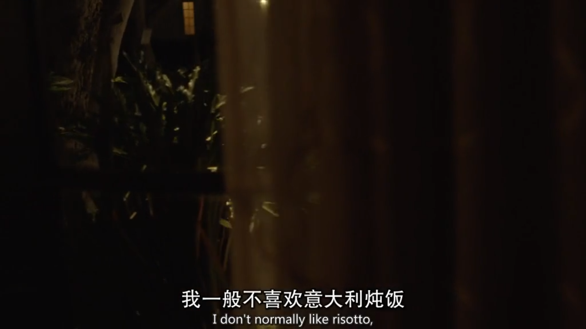

don't normally like 一般不喜欢

risotto /rɪˈzɔːtoʊ/ 意大利肉汁烩饭

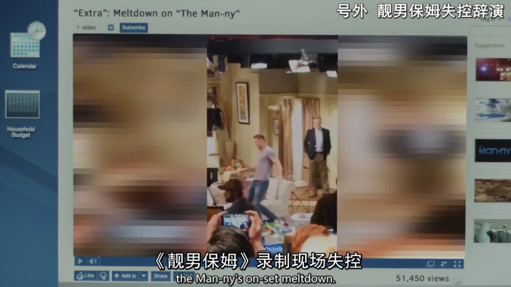

meltdown 崩溃，融化，核反应堆核心熔毁（导致核辐射泄漏）

The country is in economic meltdown.
该国的经济崩溃。

a meltdown on the New York Stock Exchange
纽约股票市场的崩盘

I'll put $20 on a total meltdown.
我将出20元打赌他彻底垮台.

Penny dies horribly in a nuclear meltdown.
佩妮就会在核外泄中惨死。

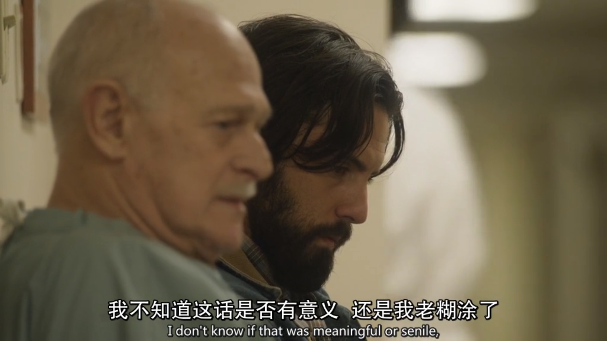

senile /ˈsiːnaɪl/ 老衰的，高龄所致的

And I can't believe you told me that she was senile!
我也不敢相信你跟我说她有老年痴呆！

I may be old, Elijah, but I'm hardly senile.
我虽然很老了 以利亚 但我不糊涂。

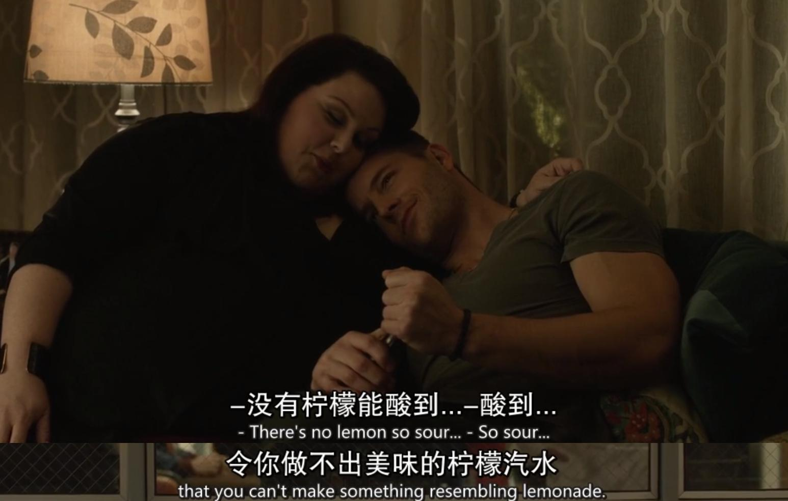

resemble v. 类似

She closely resembles her sister.
她和她姐姐很像。

Because they closely resemble traditional Chinese gold.
因为水饺的样子与中国的金元宝相似。

The brothers resemble each other in taste.
那对兄弟兴趣相似。

buy sth for cash 现金购货