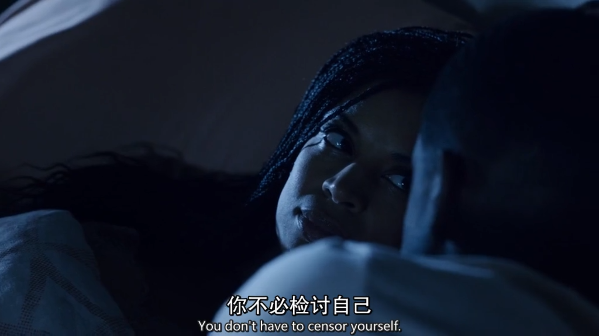

`censor` v. 检查，删减。n.检察员

The news reports had been heavily **censored**. 这些新闻报道已被大肆删剪。

the **censors** had **whittled away** at the **racy** dialogue. 审查员们对下流的对话内容进行了删减。

`racy` adj. 不雅的，带荤的，激扬的

a **racy** novel 带荤的小说

`whittle` 削，减

Hagrid had obviously **whittled** it himself. 显然是海格自已动手做的。

I finally managed to **whittle down** the names on the list to only five. 我最后总算把名单上的名字减少到了只有五个。

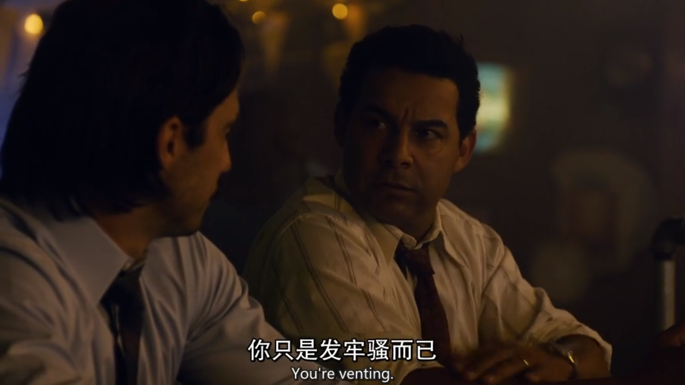

vent n.通风孔 v.发泄感情

I guess I just needed to **vent**. 我猜我只是要发泄一下。

 I need to **vent** with alcohol. 我要纵酒发泄一下。

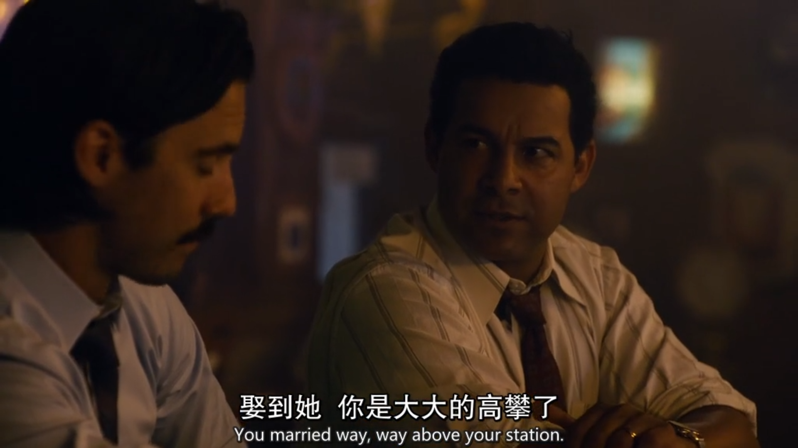

Marry Above One's Station: 攀高门亲

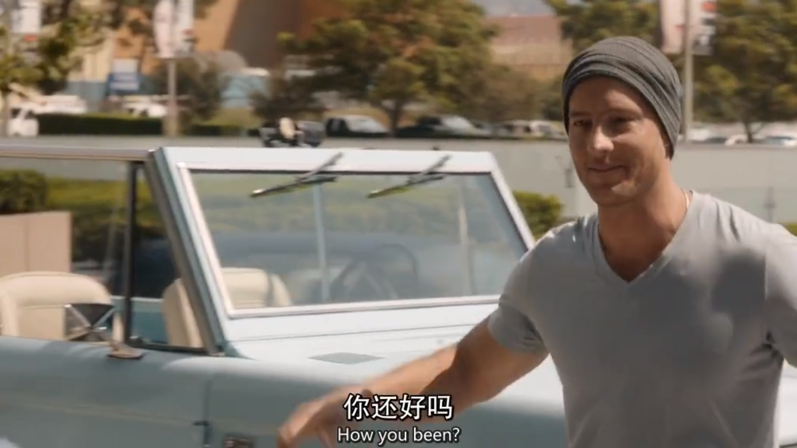

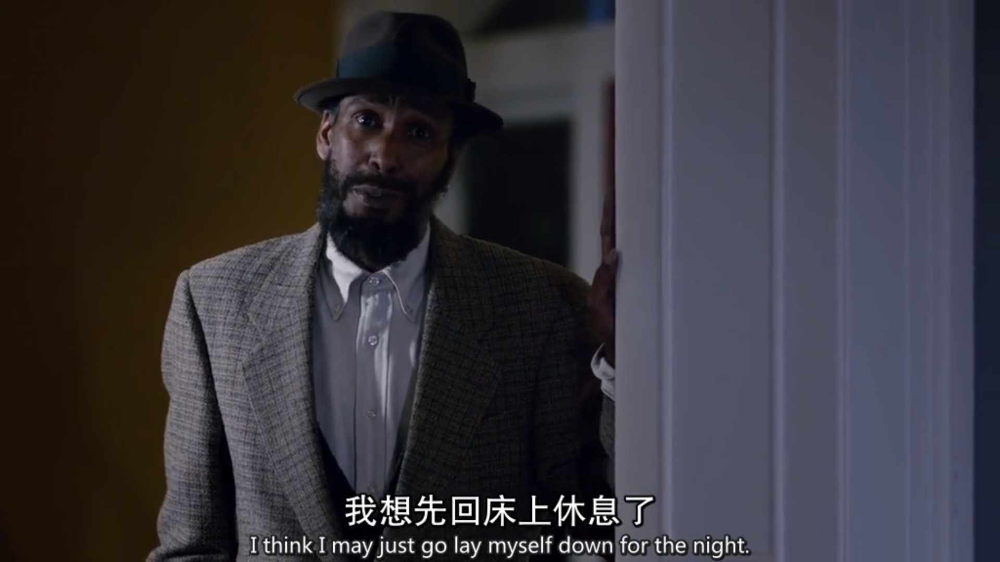

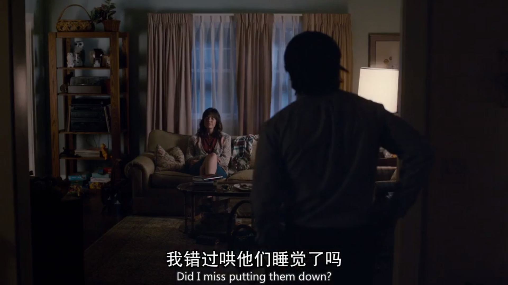

to put a baby to bed 安置（婴儿）入睡

Can you be quiet — I've just **put the baby down**. 请安静点。我刚哄小孩睡着了。

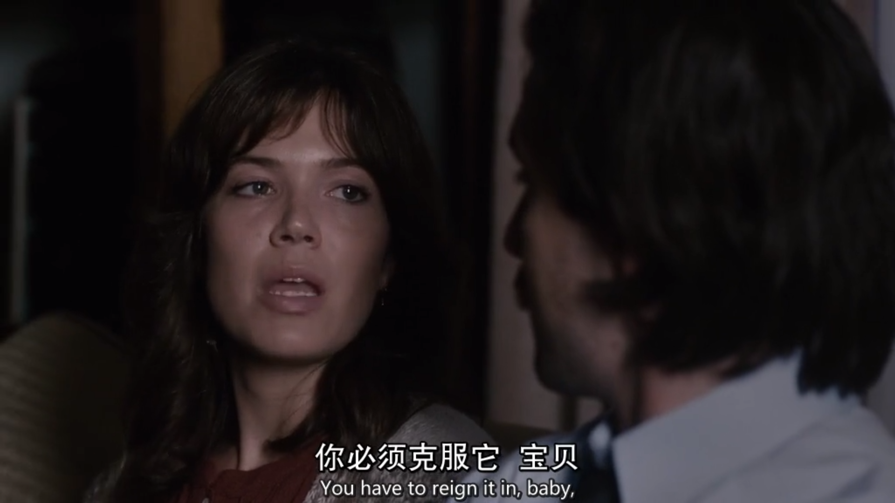

reign /reɪn/ n. v. 统治

Queen Victoria reigned from 1837 to 1901. 维多利亚女王自 1837 年至 1901 年在位。

He reigned over the small country for ten years. 他统治这个小国家10年。

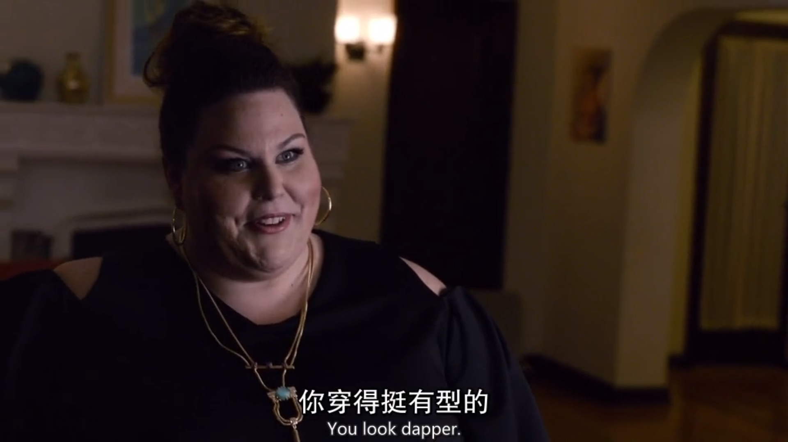

`dapper` adj. (尤指男子)整洁漂亮的, 动作敏捷的

where were you going looking so **dapper**? 你是想去哪里啊 穿这么衣冠楚楚！

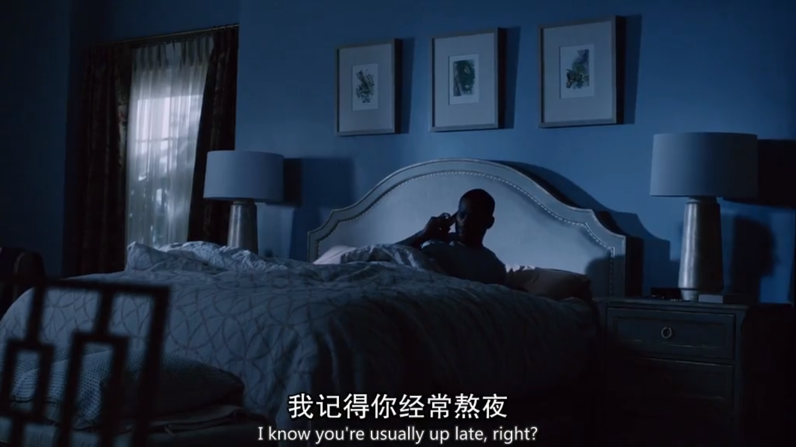

`up late` 熬夜

`stay up late ` 熬夜

sit up late 熬夜

I **stayed up late** to watch the soccer game.我昨天熬夜看了足球比赛。

The council sat up late talking about Keesh and the meat. 委员会一晚上没睡，都在讨论基什和他打回来的肉

`get up late` 起晚

`wake up late` 起晚

`show up late` 迟到

Mary frequently **shows up late** for work. 玛丽上班经常迟到。

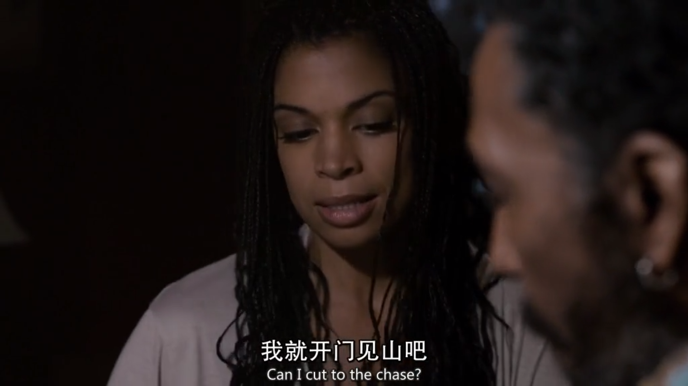

`cut to the chase` 开门见山

Uh, can we just **cut to the chase**? 我们能直接切入正题吗？

I'm gonna **cut to the chase** with you. 我就直话直说了。

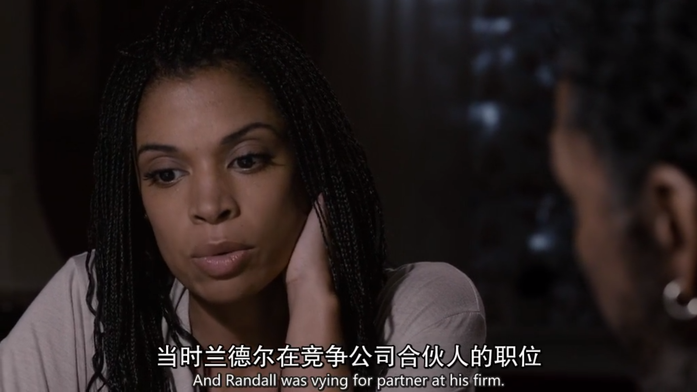

vying anj.竞争的

There are a lot of people **vying for** the postition. 很多人在争夺这个职位。

The children were **vying for** the teacher’s attention. 孩子们都较着劲想得到老师的注意。

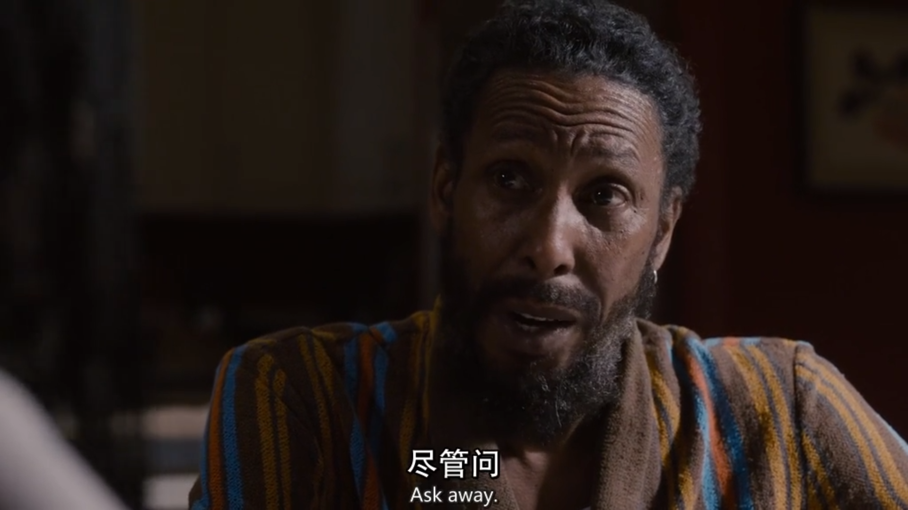

Ask away 随便问吧

Ask away unless it's about your father. 随便问 除非是关于你父亲的。

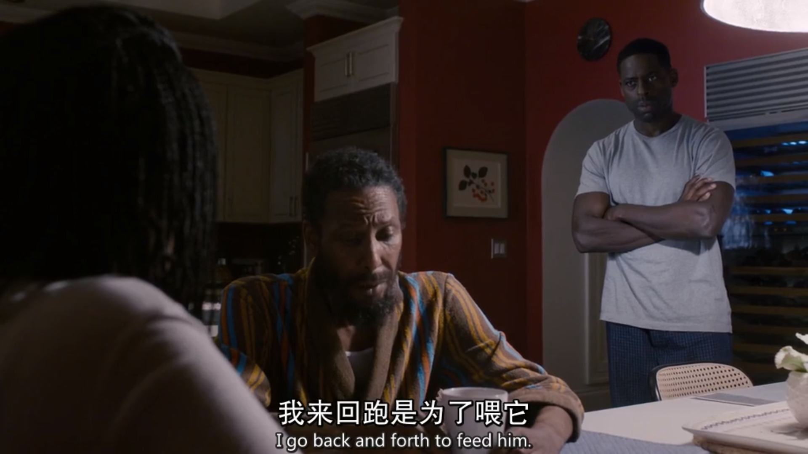

`back and forth` 反复来回

So what, do we just **go back and forth**? 怎么 以后我们就这样来回跑吗？

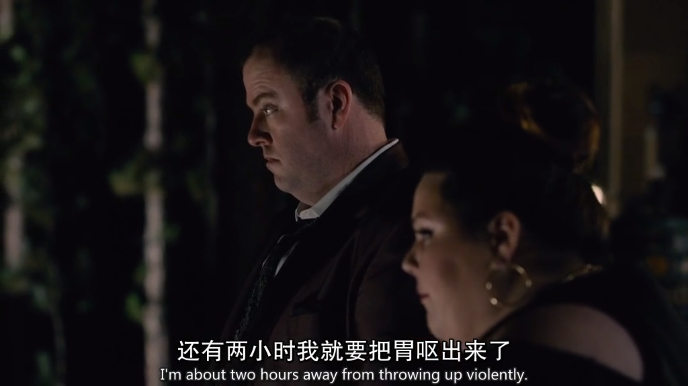

`throw up` 呕吐，恶心 to `vomit`

I feel sick. I'm going to **throw up**. 我不太舒服，我想吐。

The smell made her want to vomit. 那气味使得她想要吐。

He had **vomited up** his supper. 他把晚饭吃的东西都吐了出来。`vomit up` 都吐出来

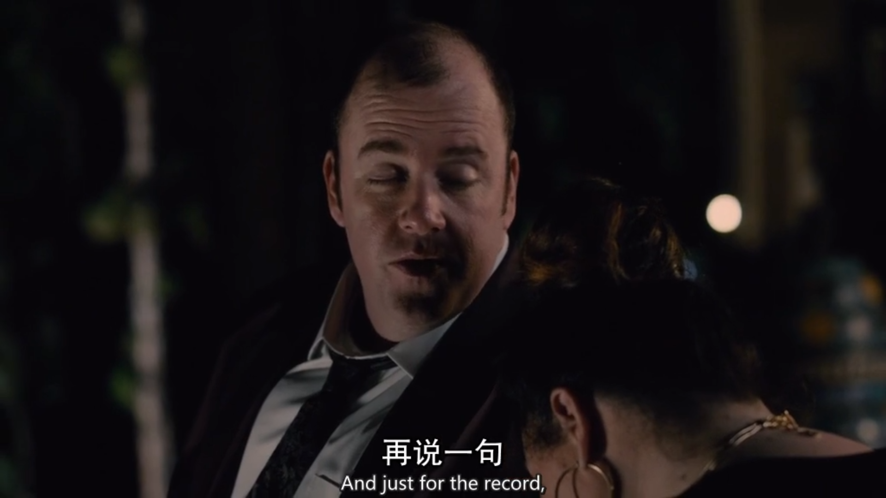

`just for the record` 强调要点以引起注意，需要强调的是

**Just for the record**, I did not want to be a part of this. 只是强调一下 我并不想参与其中的。

**Just for the record**, I have never entered. 顺便说下 我可从来没玩过

**Just for the record**, my efforts to establish you as the **alpha male** 声明一下 我努力为你营造猛男形象

`alpha male` 老大（某一群体中最有权力的男子或雄性动物）,大男子主义者

You make it so hard to be a modern post-feminist when you get so **Alpha-male**. 你这么大男子主义让现代后女权主义者很难堪啊。

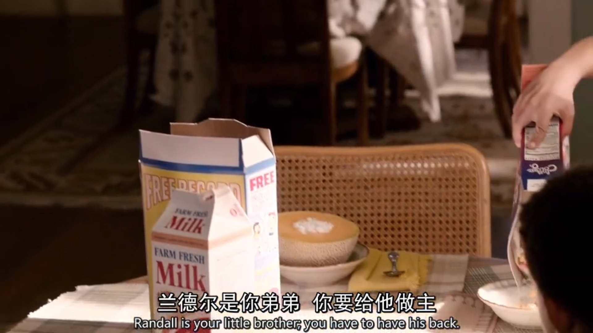

`have one's back` 保护某人

He **stood up for** me, I decided that I would always **have his back**. 他为我挺身而出?我决定永远保护他。

stand up for sb. 拥护某人

You guys need to **stand up for yourselves**. 你们得站出来替自己说话。

It's not rash. It's **standing up for myself**. 这不是冲动 我只是要为自己讨个公道。