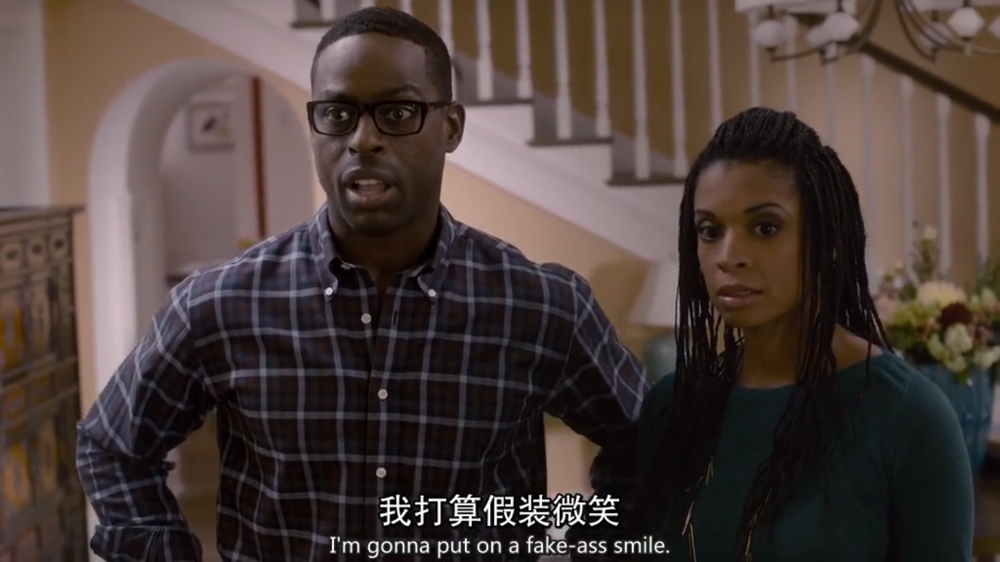
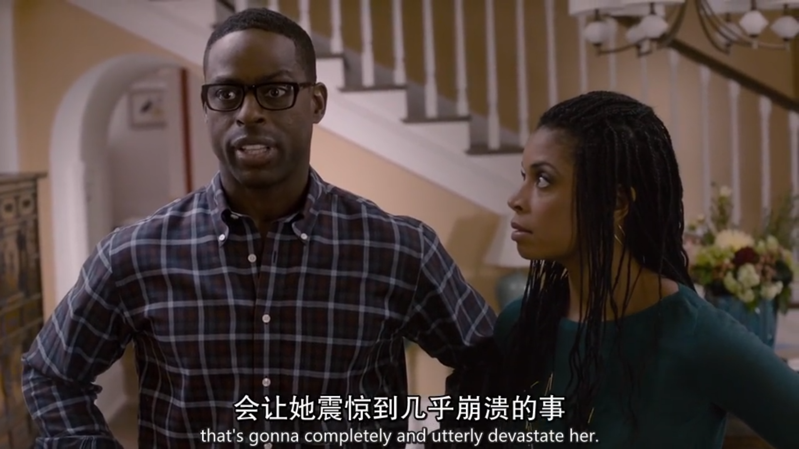
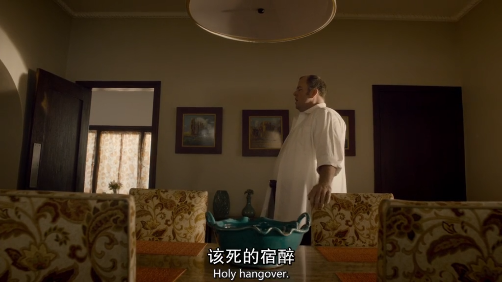
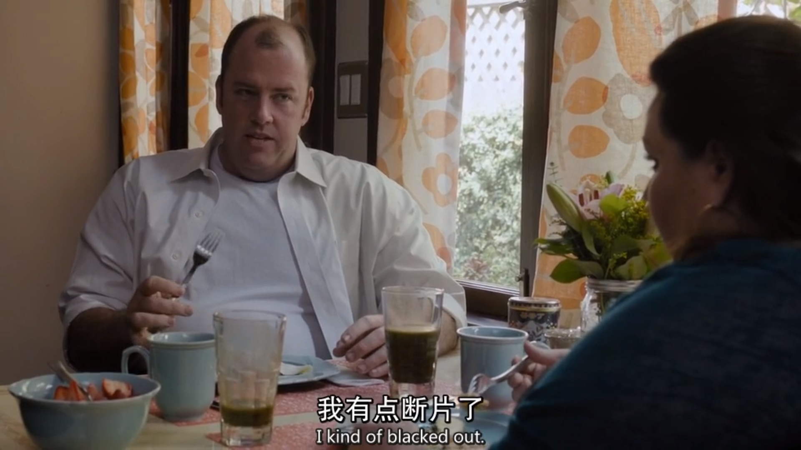
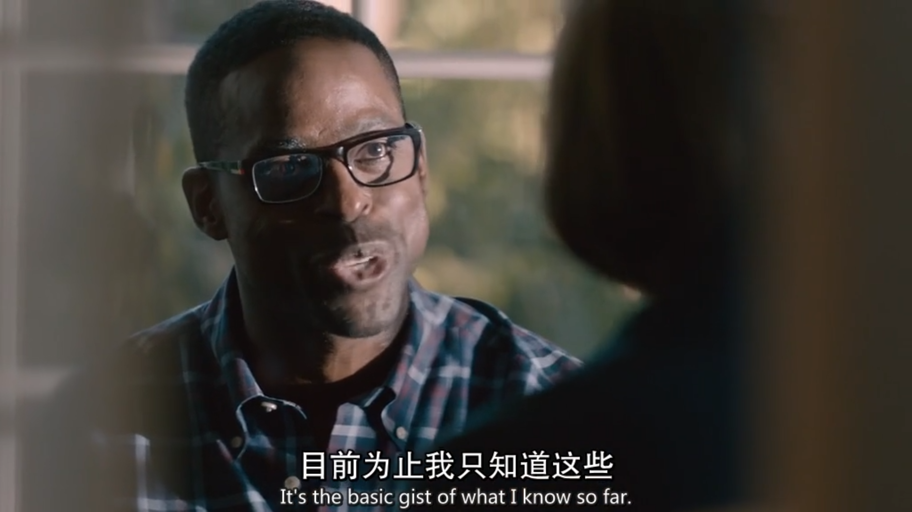
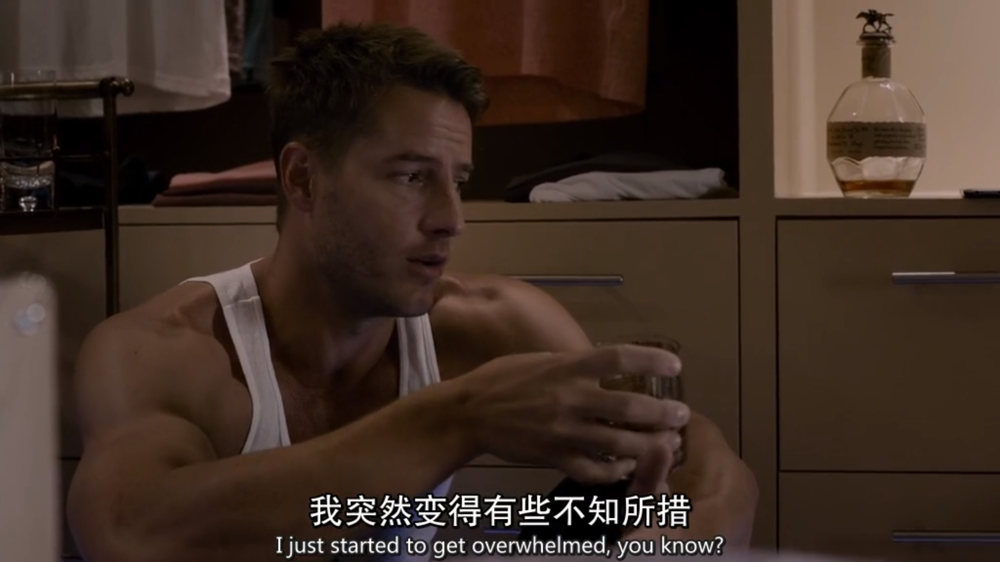
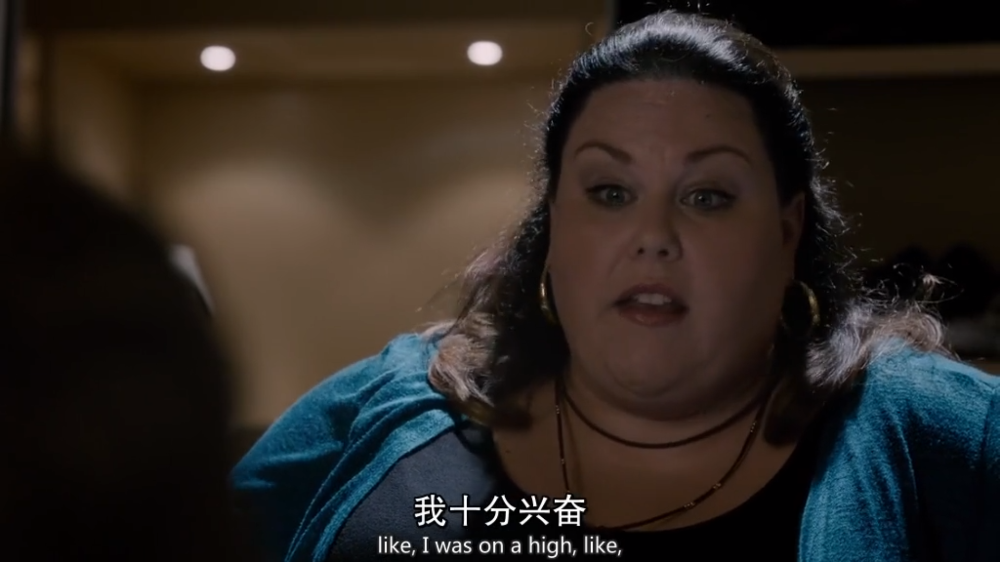

`put on`

穿上，戴上，化妆：She's just putting on her make-up.

假装：I don't think she was hurt. She was just putting it on.

He put on an American accent. 他假操着一口美国腔。

Then let's put on a great show. 那就好好表演一番吧。

赌钱：I've never put money on a horse. 我从未赌过马。

`completely and utterly` 完全彻底的

I mean, she is completely and utterly, 100% miserable. 我是说 她是完全的彻底的100%的痛苦。

`devastate` 毁坏；使震惊；使极为忧伤；使极为悲痛

So it was a very devastating situation. 那情景真令人心碎。

Oh, I'm sure Nabulangi will be devastated. 噢 我想Nabulangi肯定会崩溃的。

`hangover` 宿醉, 沿袭下来的风俗（或思想等）

She woke up with a terrible hangover. 她醒来时宿醉反应很厉害。

hangover laws from the previous administration 从上届政府沿袭下来的法律

hangovers from prewar legislation. 战前立法的遗留物

`black out` 昏厥；断片；停电；新闻封锁；一片黑

She blacked out for an hour. 她失去知觉一个小时。

She had a blackout and couldn't remember anything about the accident. 她眼前一黑，那场事故就怎么也想不起来了。

This is so cool, you guys. The entire city's blacked out. 这简直是酷毙了 纽约大停电。

`gist` 主旨，要点

I suppose that's the gist of it. 但是 没错 我想这就是要点。

Oh, uh-- the gist is, he's willing to pay you to pretend to be his girlfriend. 今天来目的就是，他愿意付你钱 请你假扮他女朋友。

get overwhelmed 不知所措

So my first tip is don't get overwhelmed. 我的第一个建议是不要不知所措。

That's gonna take too long, and you're gonna get overwhelmed. 那样太费时了，而且你会头昏脑胀。

Thank you. This is all so overwhelming. 感谢各位 这太突然了。

on a high: 成功的欢乐感；处于吸毒后的快感状态

Sorry, we're on a major flan high. 抱歉，派饼让我们爽歪了。

